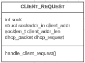
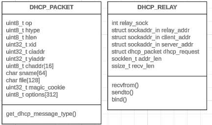

## Métodos del cliente DHCP:

- `construct_dhcp_discover()`: Construye un paquete DHCP Discover para que el cliente busque un servidor DHCP.
- `construct_dhcp_request()`: Construye un paquete DHCP Request para solicitar una IP ofrecida.
- `renew_lease()`: Envía una solicitud para renovar el lease de la IP ofrecida.
- `parse_dhcp_options()`: Analiza las opciones del paquete DHCP recibido (máscara de red, gateway, DNS).
- `print_ip_bytes()`: Función auxiliar para imprimir los bytes de una dirección IP en formato legible.

## ORGANIZAR

---

## Métodos del relay DHCP:

- `get_dhcp_message_type()`: Recorre las opciones del paquete DHCP para obtener el tipo de mensaje (Discover, Request, Offer, etc.).
- `recvfrom()`: Recibe un paquete desde el cliente o servidor.
- `sendto()`: Envía un paquete al cliente o servidor.
- `bind()`: Asocia el socket del relay con una dirección específica.

## Diagramas de secuencia (Relay):

1. **DHCP Discover**: El cliente envía este mensaje para encontrar un servidor DHCP.

- En el cliente, se utiliza la función `construct_dhcp_discover()` para construir este mensaje.
- El cliente envía el DHCP Discover al relay. En el relay , se recibe este mensaje utilizando `recvfrom()`. Luego, el relay reenvía el DHCP Discover al servidor DHCP usando `sendto()`.

2. **DHCP Offer**: El servidor responde con un mensaje que ofrece una dirección IP al cliente.

- En el servidor, se utiliza la función `construct_dhcp_offer()` para construir este mensaje y asignar una IP.
- El servidor DHCP envía el DHCP Offer al relay. El relay recibe este mensaje y lo reenvía al cliente. En el relay, este proceso se gestiona utilizando `recvfrom()` para recibir el DHCP Offer del servidor, y luego `sendto()` para reenviarlo al cliente.

3. **DHCP Request**: El cliente solicita formalmente la IP ofrecida.

- En el cliente, se utiliza la función `construct_dhcp_request()` para solicitar la IP que le fue ofrecida en el DHCP Offer.
- El cliente envía el DHCP Request al relay. El relay recibe este mensaje y lo reenvía al servidor DHCP utilizando el mismo proceso de `recvfrom()` y `sendto()` para reenviar la solicitud.

4. **DHCP ACK**: El servidor confirma la asignación de la IP con un mensaje de ACK.

- En el servidor, se utiliza la función `construct_dhcp_ack()` para confirmar la asignación de la IP al cliente.
- El servidor DHCP envía el DHCP ACK al relay. El relay recibe este DHCP ACK y lo reenvía al cliente usando las mismas funciones de `recvfrom()` y `sendto()`.
