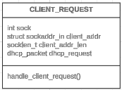
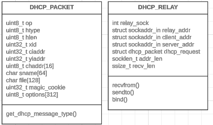
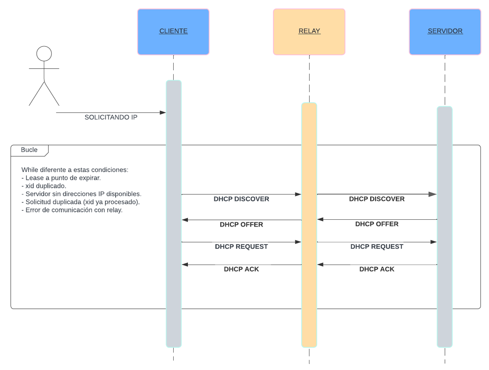



# Proyecto de DHCP (Cliente y Servidor)
## Introducción

El objetivo de este proyecto es implementar un **servidor DHCP** y un **cliente DHCP** utilizando el lenguaje de programación C. El protocolo DHCP (Dynamic Host Configuration Protocol) es esencial en redes modernas, ya que permite la asignación dinámica de direcciones IP y otros parámetros de configuración de red a dispositivos cliente, sin la necesidad de configuración manual. Este proyecto busca replicar las funcionalidades básicas del protocolo DHCP, incluyendo el manejo de mensajes clave, la gestión de arrendamientos (leases), la concurrencia para atender múltiples solicitudes y el manejo de solicitudes duplicadas basadas en la dirección MAC de los clientes.

## Desarrollo del proyecto
### Archivos del proyecto

1. `dhcp_server.c`: Implementación del servidor DHCP que escucha solicitudes de clientes, asigna direcciones IP y envía respuestas con información de configuración de red.
2. `dhcp_client.c`: Implementación del cliente DHCP que envía solicitudes al servidor DHCP y recibe la asignación de una dirección IP, junto con información de red como la máscara de subred, puerta de enlace y servidor DNS.
3. `dhcp_relay.c`: Implementación del relay DHCP que facilita la comunicación entre clientes y servidores que no están en el mismo segmento de red.

### `dhcp_server.c`

El servidor DHCP escucha solicitudes de **DHCP Discover** de los clientes en el puerto 67 (puerto estándar para DHCP en IPv4). Cuando recibe una solicitud válida, responde con un **DHCP Offer**, ofreciendo una dirección IP y otros parámetros de red como la máscara de subred, puerta de enlace y servidor DNS. Luego, si el cliente responde con un **DHCP Request** para confirmar la oferta, el servidor asigna la dirección IP y envía una respuesta **DHCP Acknowledgement**.

El servidor tiene una tabla de direcciones IP disponibles y registra qué direcciones han sido asignadas y a qué clientes (identificados por su dirección MAC).

#### Funcionalidades Implementadas
-   **Envío de DHCPDISCOVER**: El cliente envía un mensaje DHCPDISCOVER al servidor DHCP para solicitar una dirección IP.
-   **Recepción de DHCPOFFER**: El cliente recibe un mensaje DHCPOFFER del servidor con una dirección IP ofrecida y otros parámetros de red.
-   **Envío de DHCPREQUEST**: El cliente envía un mensaje DHCPREQUEST para solicitar formalmente la dirección IP ofrecida.
-   **Recepción de DHCPACK**: El cliente recibe un mensaje DHCPACK confirmando la asignación de la dirección IP.
-   **Gestión de Leases**: El cliente gestiona el tiempo de arrendamiento (lease) y solicita renovaciones cuando es necesario.
-   **Liberación de IP**: Al finalizar la ejecución, el cliente libera la dirección IP asignada pasado el tiempo del lease.

#### Aspectos Clave de la Implementación

-   **Estructura del Paquete DHCP**: Se definió una estructura `dhcp_packet` que representa el formato estándar de un paquete DHCP, incluyendo campos como `op`, `htype`, `hlen`, `xid`, `chaddr`, entre otros.
-   **Generación de XID Único**: Se utiliza un identificador de transacción (`xid`) aleatorio para cada sesión, asegurando que las comunicaciones sean únicas y puedan ser identificadas correctamente por el servidor.
-   **Manejo de Opciones DHCP**: El cliente analiza las opciones recibidas en los mensajes DHCP, como la máscara de subred, puerta de enlace predeterminada y servidor DNS.
-   **Gestión del Tiempo de Arrendamiento**: Implementación de un ciclo que verifica el tiempo restante del lease y envía solicitudes de renovación antes de que expire.

### `dhcp_client.c`

El cliente DHCP envía un mensaje **DHCP Discover** en broadcast para encontrar un servidor DHCP. Una vez que recibe un **DHCP Offer**, el cliente analiza el paquete, muestra la dirección IP ofrecida y la información de red proporcionada (máscara de subred, puerta de enlace y servidor DNS). Posteriormente, envía un **DHCP Request** al servidor para confirmar la aceptación de la dirección IP, y recibe una respuesta final de **DHCP Acknowledgement** con la asignación definitiva.



#### Métodos del cliente DHCP:
- `construct_dhcp_discover()`: Construye un paquete DHCP Discover para que el cliente busque un servidor DHCP.
- `construct_dhcp_request()`: Construye un paquete DHCP Request para solicitar una IP ofrecida.
- `renew_lease()`: Envía una solicitud para renovar el lease de la IP ofrecida.
- `parse_dhcp_options()`: Analiza las opciones del paquete DHCP recibido (máscara de red, gateway, DNS).
- `print_ip_bytes()`: Función auxiliar para imprimir los bytes de una dirección IP en formato legible.

#### Funcionalidades Implementadas

-   **Escucha de Solicitudes DHCP**: El servidor escucha en el puerto 67 para recibir mensajes DHCP de clientes.
-   **Asignación Dinámica de IPs**: Gestiona un pool de direcciones IP definido por el usuario y asigna dinámicamente direcciones disponibles a los clientes.
-   **Manejo de Mensajes DHCP**: Procesa los cuatro mensajes principales del protocolo DHCP: DHCPDISCOVER, DHCPOFFER, DHCPREQUEST y DHCPACK.
-   **Gestión de Leases**: Controla el tiempo de arrendamiento de las direcciones IP asignadas y libera las IPs cuando el lease expira.
-   **Concurrencia**: Implementa hilos (threads) para manejar múltiples solicitudes de clientes simultáneamente.
-   **Manejo de Solicitudes Duplicadas**: Verifica si una dirección MAC ya tiene una IP asignada para evitar asignaciones duplicadas.

#### Aspectos Clave de la Implementación

-   **Estructura del Pool de IPs**: Se define una estructura `ip_assignment` que almacena la IP asignada, la MAC del cliente, el inicio y duración del lease, y el `xid` para identificar solicitudes.
-   **Mutex para Sincronización**: Se utiliza un mutex (`pthread_mutex_t pool_mutex`) para proteger el acceso al pool de IPs y evitar condiciones de carrera en entornos concurrentes.
-   **Hilos para Concurrencia**: Cada solicitud entrante es manejada por un nuevo hilo creado con `pthread_create`, permitiendo al servidor atender múltiples clientes al mismo tiempo.
-   **Gestión de Leases**: Una función periódica verifica y libera las IPs cuyos leases han expirado.
-   **Manejo de Mensajes DHCP**: Se implementan funciones para construir y enviar mensajes DHCPOFFER, DHCPACK y DHCPNAK, siguiendo el formato y opciones del protocolo.

### `dhcp_relay.c`


#### Métodos del relay DHCP:

- `get_dhcp_message_type()`: Recorre las opciones del paquete DHCP para obtener el tipo de mensaje (Discover, Request, Offer, etc.).
- `recvfrom()`: Recibe un paquete desde el cliente o servidor.
- `sendto()`: Envía un paquete al cliente o servidor.
- `bind()`: Asocia el socket del relay con una dirección específica.

#### Funcionalidades Implementadas
-   **Reenvío de Mensajes DHCP**: El relay recibe mensajes DHCP de clientes en una subred y los reenvía al servidor DHCP en otra subred.
-   **Modificación del Campo `giaddr`**: El relay actualiza el campo `giaddr` (Gateway IP Address) en los paquetes DHCP para indicar al servidor la dirección del relay.
-   **Gestión de Respuestas**: Recibe las respuestas del servidor DHCP y las reenvía al cliente original.
#### Aspectos Clave de la Implementación
-   **Socket UDP**: El relay utiliza sockets UDP para recibir y enviar paquetes DHCP.
-   **Análisis del Tipo de Mensaje DHCP**: Se implementa una función para extraer el tipo de mensaje DHCP de las opciones del paquete.
-   **Direcciones de Enlace**: Configura correctamente las direcciones y puertos para la comunicación entre el cliente, el relay y el servidor.

### Mensajes DHCP Implementados

#### Diagramas de secuencia:
El DHCP Relay actúa como intermediario entre el cliente DHCP y el servidor DHCP cuando están en diferentes subredes. Permite que las solicitudes DHCP atraviesen las subredes, asegurando que un solo servidor DHCP pueda gestionar direcciones IP para múltiples redes.


1. **DHCP Discover**: El cliente envía este mensaje para encontrar un servidor DHCP.

- En el cliente, se utiliza la función `construct_dhcp_discover()` para construir este mensaje.
- El cliente envía el DHCP Discover al relay. En el relay , se recibe este mensaje utilizando `recvfrom()`. Luego, el relay reenvía el DHCP Discover al servidor DHCP usando `sendto()`.

2. **DHCP Offer**: El servidor responde con un mensaje que ofrece una dirección IP al cliente.

- En el servidor, se utiliza la función `construct_dhcp_offer()` para construir este mensaje y asignar una IP.
- El servidor DHCP envía el DHCP Offer al relay. El relay recibe este mensaje y lo reenvía al cliente. En el relay, este proceso se gestiona utilizando `recvfrom()` para recibir el DHCP Offer del servidor, y luego `sendto()` para reenviarlo al cliente.

3. **DHCP Request**: El cliente solicita formalmente la IP ofrecida.

- En el cliente, se utiliza la función `construct_dhcp_request()` para solicitar la IP que le fue ofrecida en el DHCP Offer.
- El cliente envía el DHCP Request al relay. El relay recibe este mensaje y lo reenvía al servidor DHCP utilizando el mismo proceso de `recvfrom()` y `sendto()` para reenviar la solicitud.
  
4. **DHCP ACK**: El servidor confirma la asignación de la IP con un mensaje de ACK.

- En el servidor, se utiliza la función `construct_dhcp_ack()` para confirmar la asignación de la IP al cliente.
- El servidor DHCP envía el DHCP ACK al relay. El relay recibe este DHCP ACK y lo reenvía al cliente usando las mismas funciones de `recvfrom()` y `sendto()`.


### Concurrencia
#### Manejo de Múltiples Clientes
El servidor DHCP está diseñado para manejar múltiples solicitudes de clientes simultáneamente. Esto es crucial en entornos de red donde varios dispositivos pueden estar intentando obtener configuraciones de red al mismo tiempo.
#### Implementación de Hilos
Para gestionar eficazmente las múltiples solicitudes y mantener un servicio fluido y reactivo, se utiliza la librería `pthread`. Esta librería permite la creación de hilos que operan de manera independiente para cada solicitud de cliente. Cada hilo maneja el ciclo completo de la comunicación DHCP para un cliente específico, desde la recepción del DHCPDISCOVER hasta el envío del DHCPACK.
#### Sincronización
Dado que múltiples hilos pueden acceder y modificar el pool de direcciones IP simultáneamente, se emplea un bloqueo/mutex (`pthread_mutex_t`) para sincronizar el acceso. El mutex garantiza que solo un hilo pueda interactuar con el pool de IPs en cualquier momento, previniendo así condiciones de carrera y asegurando la integridad de los datos.

### Gestión de Leases
#### Tiempo de Arrendamiento
Cada dirección IP asignada por el servidor tiene un tiempo de lease definido, que en este caso es de 60 segundos. Este lease determina el período durante el cual el cliente puede utilizar la dirección IP sin necesidad de renovación.
#### Renovación y Expiración
El servidor mantiene un seguimiento del tiempo de arrendamiento de cada IP asignada. Antes de que expire un lease, el servidor espera recibir un DHCPREQUEST del cliente solicitando la renovación. Si no se recibe tal solicitud, el servidor libera la IP para que pueda ser reasignada a otro cliente.
#### Actualización de Leases
Cuando se recibe un DHCPREQUEST para la renovación de una IP, el servidor actualiza la información del lease asociada con esa IP en su pool. Esto incluye reiniciar el contador del tiempo de lease, permitiendo al cliente continuar usando la IP por otro período completo de lease.

### Manejo de Solicitudes Duplicadas (MAC)
#### Verificación de MAC
Antes de asignar una nueva IP a un cliente, el servidor verifica si la dirección MAC del cliente ya tiene una IP asignada. Esta comprobación previene asignaciones duplicadas y permite una gestión eficiente del pool de direcciones IP.
#### Reutilización de IP
Si un cliente con una MAC conocida solicita una dirección IP y ya posee una cuyo lease no ha expirado, el servidor simplemente reofrece la misma IP. 
#### Control de xid
El servidor utiliza el identificador de transacción (`xid`) junto con la dirección MAC para detectar y gestionar solicitudes duplicadas. Esto asegura que las respuestas a solicitudes antiguas o repetidas no sean procesadas innecesariamente.

### Aspectos Clave del Desarrollo

#### Programación de Sockets

Para la comunicación de red, el proyecto utiliza sockets UDP (`SOCK_DGRAM`). Los sockets UDP son ideales para el protocolo DHCP debido a su naturaleza sin conexión, lo que permite una comunicación rápida y eficiente sin la sobrecarga de establecer y mantener una conexión. Esta característica es esencial para DHCP, que necesita manejar rápidamente grandes volúmenes de solicitudes breves y distribuidas.

#### Estructuras de Datos

Se definen estructuras específicas para los paquetes DHCP y las asignaciones de IP, que reflejan los campos requeridos por el protocolo DHCP. Esto incluye elementos como `op`, `htype`, `hlen`, `xid`, y más, lo cual es crucial para el correcto formato y procesamiento de los mensajes DHCP.

#### Análisis de Opciones DHCP

Se implementan funciones para construir y analizar las opciones dentro de los paquetes DHCP. Esto permite al servidor y al cliente manejar configuraciones de red flexibles y proporcionar funcionalidades como la asignación de DNS y gateways.

#### Manejo de Errores

El proyecto incluye robustos controles de errores para manejar situaciones como la recepción de paquetes corruptos, la falta de direcciones IP disponibles y errores de red. Esto asegura que el servidor pueda operar de manera continua y confiable.

#### Configuración de Red

Se configuran específicamente rangos de direcciones IP y puertos para adaptarse a las necesidades del proyecto, considerando un entorno controlado. Esta configuración permite simular un entorno de red realista y validar el comportamiento del servidor y cliente DHCP.

## Aspectos Logrados y No Logrados

### Aspectos Logrados

-   **Implementación Completa de los Mensajes DHCP Principales**: Se logró implementar exitosamente los mensajes DHCPDISCOVER, DHCPOFFER, DHCPREQUEST y DHCPACK.
-   **Asignación Dinámica de IPs**: El servidor asigna direcciones IP de manera dinámica a los clientes, gestionando un pool de IPs disponible.
-   **Concurrencia y Manejo de Múltiples Clientes**: Gracias a la implementación de hilos, el servidor puede atender múltiples solicitudes simultáneamente sin bloqueos.
-   **Gestión de Leases**: Se implementó correctamente la gestión del tiempo de arrendamiento de las IPs, incluyendo la liberación de direcciones expiradas.
-   **Manejo de Solicitudes Duplicadas**: El servidor verifica si un cliente ya tiene una IP asignada y evita asignaciones duplicadas basadas en la dirección MAC y el `xid`.
-   **Implementación del Relay DHCP**: Se implementó un relay que permite a clientes en subredes diferentes comunicarse con el servidor DHCP.

### Aspectos No Logrados


## ¿Cómo ejecutar el programa?

### Requisitos Previos

#### Sistema Operativo

-   Es necesario contar con un sistema operativo basado en Unix, como Ubuntu o cualquier otra distribución de Linux, ya que las instrucciones de configuración y comandos son específicos para estos sistemas.

#### Herramientas Necesarias

-   **GCC o otro compilador de C**: Necesario para compilar los programas escritos en C. Para instalar GCC en Ubuntu, ejecuta:
```bash
sudo apt update
sudo apt install build-essential
```

#### Instalación de Herramientas de Red

Para poder configurar las interfaces de red como se requiere para la prueba de los programas DHCP, necesitas tener instalado `net-tools`. Para instalarlo en Ubuntu, ejecuta:

```bash
sudo apt install net-tools
```

## Orden de Ejecución

Es crucial iniciar los componentes en el orden correcto para asegurar que todos los elementos del sistema DHCP puedan comunicarse efectivamente:

1.  **Relay DHCP**: Debe estar en funcionamiento antes de que el servidor comience a escuchar para garantizar que cualquier paquete dirigido al servidor a través del relay sea correctamente reenviado.
2.  **Servidor DHCP**: Necesita estar activo antes de que cualquier cliente intente obtener una dirección IP.
3.  **Cliente DHCP**: Debe ser el último en iniciarse, una vez que el relay y el servidor estén listos para manejar las solicitudes.

## Configuración de Interfaces de Red
Antes de ejecutar los programas, necesitarás configurar las interfaces de red en diferentes terminales para el relay DHCP y el servidor DHCP:

### Relay DHCP:
```bash
sudo ifconfig eth0:0 192.168.0.2 netmask 255.255.255.0 up
```

### Servidor DHCP:
```bash
sudo ifconfig eth0:1 192.168.0.1 netmask 255.255.255.0 up
```

### Cliente DHCP:
```bash
sudo ifconfig eth0 0.0.0.0
```

### Compilación

Para compilar ambos archivos, necesitarás tener instalado un compilador C (como `gcc`).

#### Servidor DHCP

```bash
gcc -o dhcp_server dhcp_server.c
```

#### Cliente DHCP

```bash
gcc -o dhcp_client dhcp_client.c
```

#### Relay DHCP

```bash
gcc -o dhcp_relay dhcp_relay.c
```

### Ejecución

#### Ejecutar el Servidor DHCP

El servidor DHCP se ejecuta escuchando las solicitudes de los clientes. Debe ejecutarse como superusuario para poder abrir el puerto 67.

```bash
sudo ./dhcp_server
```

#### Ejecutar el Cliente DHCP

El cliente DHCP se ejecuta enviando una solicitud al servidor en el puerto 67 (de broadcast). Para ejecutarlo, también necesitas permisos de superusuario, ya que el cliente debe enviar paquetes de broadcast.

```bash
sudo ./dhcp_client
```

### Ejecutar el Relay DHCP

El relay DHCP se ejecuta enrutando paquetes entre el cliente y el servidor DHCP. También debe ejecutarse con permisos de superusuario para poder recibir y enviar paquetes en los puertos de red necesarios.

```bash
sudo ./dhcp_relay
```

## Conclusiones 

El desarrollo de este proyecto ha sido una experiencia enriquecedora que ha permitido profundizar en el funcionamiento interno del protocolo DHCP y en la programación de redes en C. Aunque inicialmente resultó complejo debido a la falta de experiencia previa con sockets, hilos y protocolos de comunicación, el proceso permitió adquirir conocimientos valiosos en estas áreas.

La implementación de un servidor y cliente DHCP funcionales requirió una comprensión detallada de los mensajes del protocolo, la gestión de estados y el manejo eficiente de recursos en un entorno concurrente. El uso de hilos y mutexes fue esencial para garantizar que el servidor pudiera atender múltiples solicitudes de manera segura y eficiente.

Uno de los desafíos más significativos fue asegurar la correcta sincronización en el acceso al pool de direcciones IP y evitar condiciones de carrera. Además, manejar las solicitudes duplicadas y gestionar adecuadamente los leases de las IPs asignadas añadió un nivel adicional de complejidad al proyecto.

A pesar de no haber implementado todas las funcionalidades avanzadas del protocolo DHCP, se logró construir una base sólida que cumple con los requerimientos principales y puede ser expandida en futuros trabajos.

## Referencias
- **Dynamic Host Configuration Protocol (DHCP) Basics**: [Microsoft Docs](https://learn.microsoft.com/es-es/windows-server/troubleshoot/dynamic-host-configuration-protocol-basics)
- **DHCP Configuration Guide**: [Hewlett Packard Enterprise](https://support.hpe.com/techhub/eginfolib/networking/docs/switches/5120si/cg/5998-8491_l3-ip-svcs_cg/content/436042653.htm)
- **DHCP Lease Time Explained**: [ManageEngine OpUtils](https://www.manageengine.com/products/oputils/tech-topics/dhcp-lease-time.html)
- **Conceptos básicos de redes**: [Cisco Network Academy](https://www.netacad.com/es/courses/networking-basics?courseLang=es-XL)